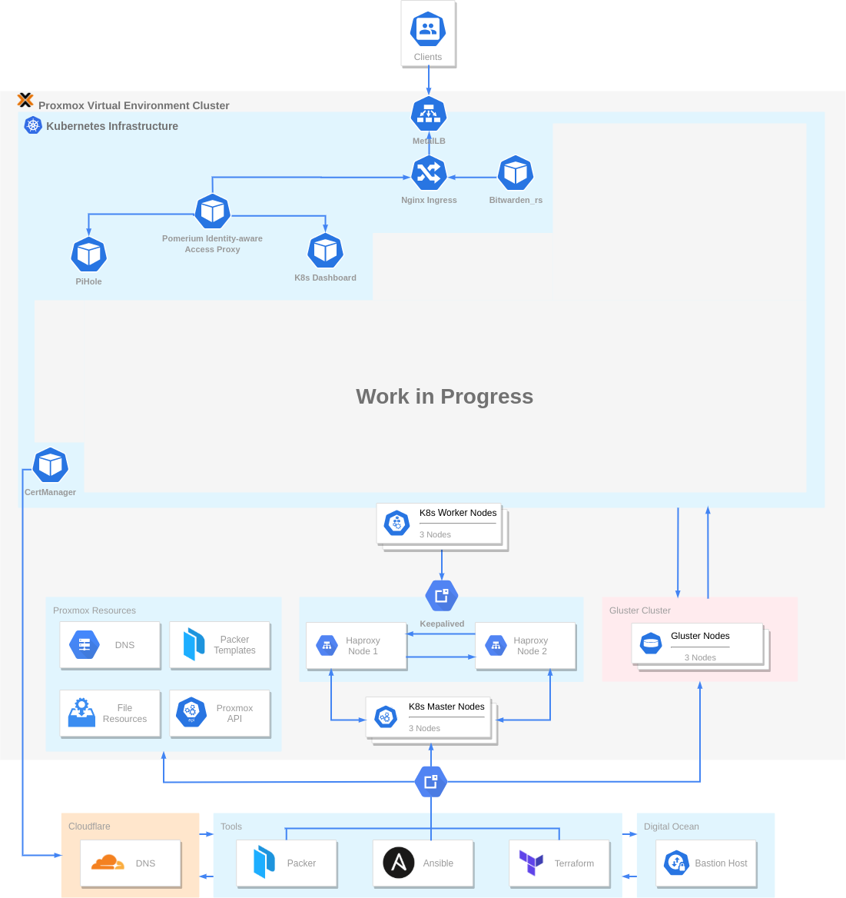

# [Proxmox](https://www.proxmox.com/) Virtual Environment #

<div align="center">

</div>

```pseudo
Kernel Version: 5.4.27-1-pve
PVE Manager Version: 6.2-6
```

## Requirements ##

- **Terraform**
- **Packer**
- **Golang > 1.14**
- **[Terraform Proxmox Plugin](https://github.com/Telmate/terraform-provider-proxmox/blob/master/docs/installation.md)**
- **Ansible**
- **Access to Proxmox API**
- **Access to Proxmox via SSH**
- **kubectl**
- **Helm**

## Folder Structure ##
- [`main`](./main.tf) - Main entry point
- [`k8s_cluster`](./k8s_cluster) - Kubernetes cluster based on [Kubespray](https://github.com/kubernetes-sigs/kubespray)
- [`k8s infrastructure`](./k8s_infrastructure) - Kubernetes infrastructure
- [`packer`](./packer.tf) - Packer deployments
    - [`templates`](./templates) - Packer templates
- [`bastion`](./bastion.tf) - Bastion Host
- [`dns_records`](./dns_records.tf) - Local & Global DNS records
- [`file`](./file.tf) - File resources (e.g. iso, lxc images)
- [`pve_nodes.yml`](./pve_nodes.yml)  - Additional configuration applied to Proxmox node
- [`requirements.yml`](./requirements.yml) - Local environment requirements (Ansible playbook)

## Current setup ##



## Quick start ##

### Step 1: Install requirements ###

```bash
make install
```

or manually install

- [Terraform](https://learn.hashicorp.com/terraform/getting-started/install.html)
- [Packer](https://learn.hashicorp.com/packer/getting-started/install)
- [Golang](https://golang.org/dl/)
- [Ansible](https://docs.ansible.com/ansible/latest/installation_guide/intro_installation.html)
- [Terraform Proxmox Plugin](https://github.com/danitso/terraform-provider-proxmox/releases)
- [kubectl](https://kubernetes.io/docs/tasks/tools/install-kubectl/)
- [Helm](https://helm.sh/docs/intro/install/)

### Step 3: Start Deployment ###

```bash
make init
make plan
make apply
```
## Notes ##

### [`pve_nodes.yml`](./pve_nodes.yml) - additional configuration applied to Proxmox node ###

- Removes Proxmox Enterprise repository from sources (`--tags subscription`)
- Adds Debian Sources repository (`--tags sources`)
- Upgrade packages (`--tags upgrade`)
- Install Intel Graphics driver (`--tags intel-graphics`)
- Removes Subscription Popup (`--tags popup`)
- Enables PCI passthrough (`--tags vfio`, requires reboot )
  - Adds bootloader options
  - Adds kernel modules
  - Blacklist Nvidia and Radeon Drivers
  - Adds PCI devices to `vfio-pci` drivers (`--extra-vars='{"vfio-pci-ids": ["1234:1234","5678:5678"]}'`)
    - To get Vendor IDs for GPU and Audio Bus
        ```bash
        # lspci -v | grep VGA # outputs: > 01:00.0 VGA controller 01:00.1 Audio Device
        # lspci -ns 01:00 # > 1234:1234, 1234:1234
      ```
- Reboot (`--tags reboot`, not invoked if not specified)
